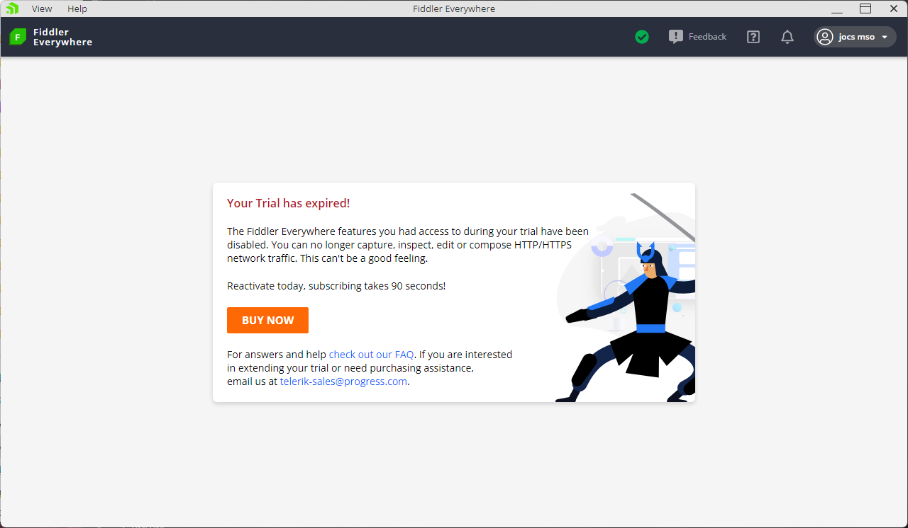
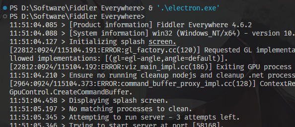
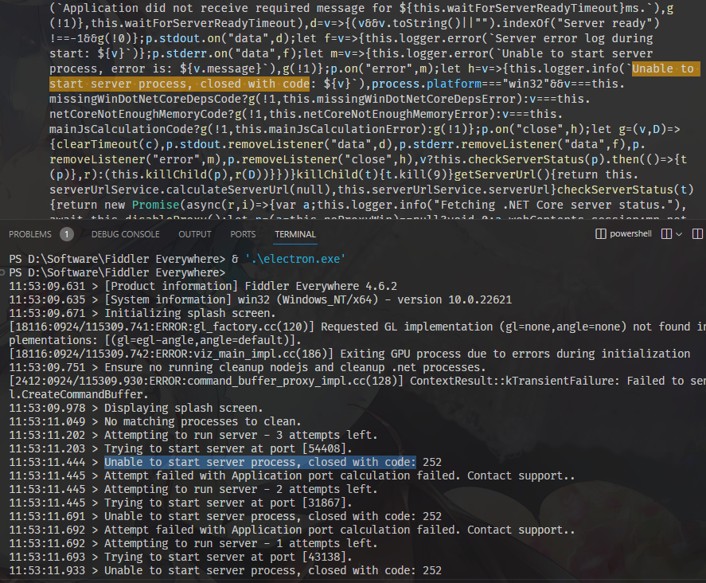
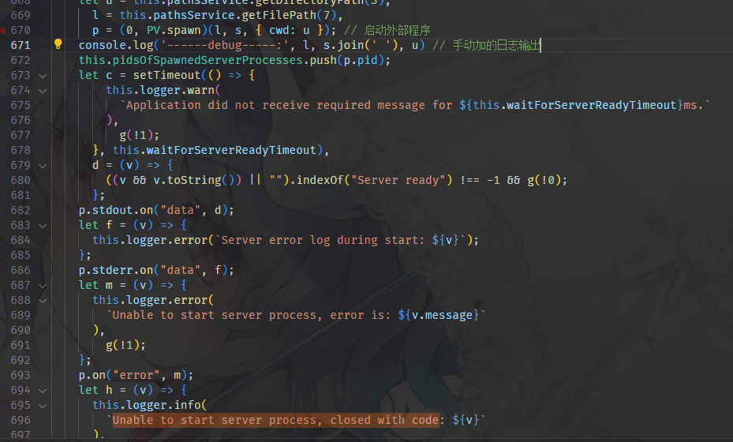
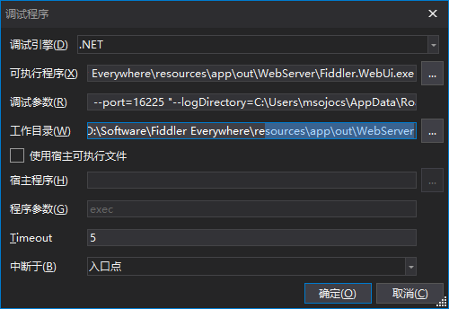
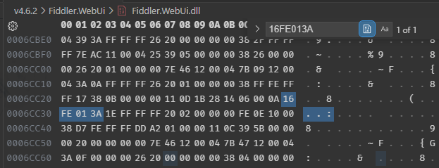
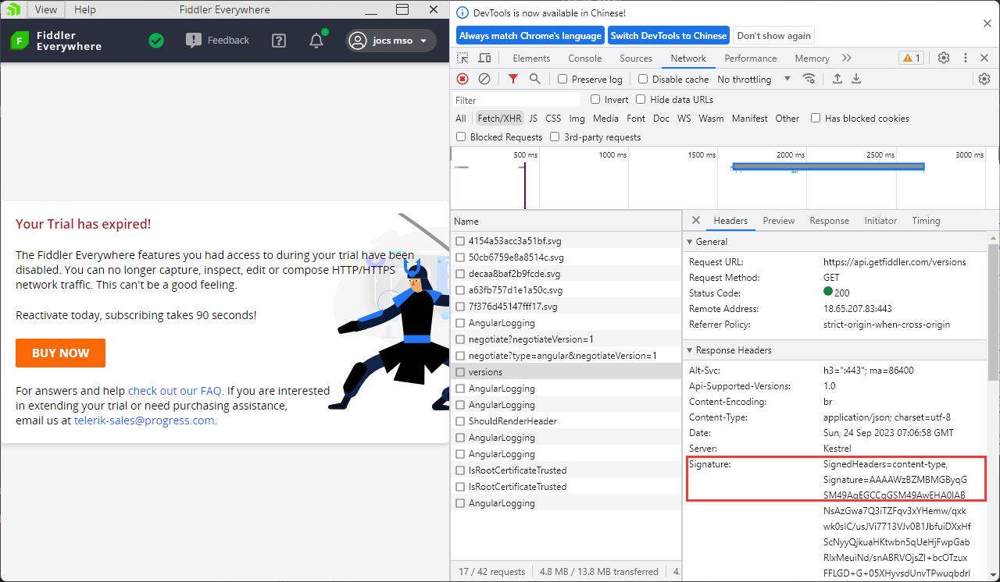
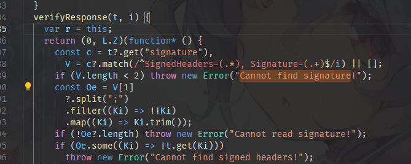
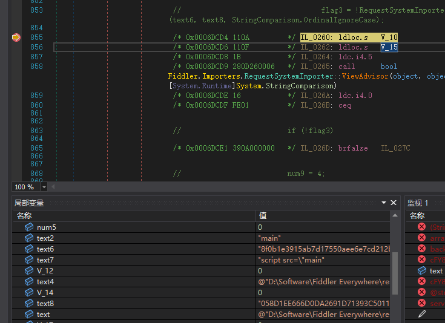
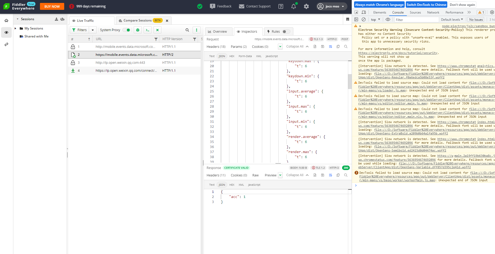

# 0 前置信息

## 0.1 大致思路

1. 修改文件，使得一些篡改检测失效
2. 搭建本地简易服务器伪造响应

## 0.2 本文常用IL对应十六进制

| IL指令 | 十六进制 |
|-------|---------|
| ret   |   0x2A   |
| ldc.i4.0 | 0x16 |
| ldc.i4.1 | 0x17 |
| ldc.i4.2 | 0x18 |
| nop | 0x00 |

# 1 安装启动

1. 下载v4.6.2并安装
2. 默认安装在C盘，但是会存在操作权限问题不方便后面修改文件
3. 移动文件到自定义的目录
4. 打开软件

    

# 2 尝试开启控制台

查看安装文件夹的内容，可以很确定这是一个基于Electron的应用，那么它就能够开启控制台。

开启控制台后，我们能通过F5即时刷新页面，免去修改过程中重开的麻烦。

使用 VS Code 打开软件目录

   

在 `./resources/app/out` 文件夹中搜索内容 `BrowserWindow(`

在每个结果后面加上 `xx.webContents.openDevTools();`, 其中xx要替换为具体变量

在VS Code控制台输入内容回车 `& '.\Fiddler Everywhere.exe'`, 尝试启动软件；

没有反应，重试也不行；

那就撤销修改再启动，欸，可以。

那说明它自带的启动器有做文件修改校验，得想办法跳过。

# 3 替换Electron

由于软件是基于Electron的，那么我们可以试试用Electron官方的软件包去启动。

## 3.1 下载Electron

1. 打开地址：[Electron Release](https://github.com/electron/electron/releases)
2. 选一个顺眼的下载，我选当前较新的 `v26.2.2`

## 3.2 替换Electron

1. 删除原有的文件，除了 `resources` 文件夹
2. 将下载的Electron中的文件赋值过去，除了 `resources` 文件夹
3. 控制台输入 `& '.\electron.exe'` 回车，欸启动了。

   
4. 此时去重试第二步，你会发现，闪退了，这时候就到第4步了。

# 4 移除main.js的校验

## 4.1 定位错误位置

  1. 查看控制台输出，可以发现由一个报错 `Unable to start server process, closed with code:252`

     
  2. 搜索该字符串并局部格式化代码
  3. 可以看出，该处启动了一个外部程序，但是这个程序执行失败了
  4. 加一个日志打印看看输出

     
  5. 输出了程序路径以及执行参数：`resources\app\out\WebServer\Fiddler.WebUi.exe --port=16225 --logDirectory=Path\To\Logs --verboseLogging=false --logMaxSize=4194304`
  6. 拼接并执行，表现与日志记录一致
      ```
      PS D:\Software\Fiddler Everywhere\resources\app\out\WebServer> ./Fiddler.WebUi.exe --port=16225 "--logDirectory=C:\Users\msojocs\AppData\Roaming\Fiddler Everywhere\Logs" --verboseLogging=false --logMaxSize=4194304
      Error while calculating application port! Contact Support
      PS D:\Software\Fiddler Everywhere\resources\app\out\WebServer> $LastExitCode 
      252
      ```
## 4.2 找出main.js校验关键点

  1. dnSpy 启动！
  2. 填写路径参数

     
  3. 通过断点调试，可以找到图中的一个hash比较代码，我们需要把flag置成总是正确的

     
  4. 正常情况下，Equals返回为true，取反就是false，也就是说flag总是false是需要达到的结果;

      IL代码中使用0与Equals比较，Equals取值有0和1，要让比较结果总是false，就把固定值0换成2;

      即 `ldc.i4.0` 换成 `ldc.i4.2`。
  5. 你可以尝试再dnSpy中修改代码保存，这是行不通的，会报错，所以只能修改二进制代码。

## 4.3 解除main.js校验

直接在 VS Code 里面搜索十六进制，直到是唯一值（0x16FE013A），然后把 0x16 改成 0x18。(step1, Fiddler.WebUi.dll)

前面有个十六进制地址，但那是包含偏移量的，所以与实际有差别。你可以直接打开一个新的这个dll，那么地址回事正确的，但是不如搜索来的快。
    
  

改完之后，替换原文件，执行命令。

你会发现错误变了，原来它还对自身进行修改检测。

```C#
Unhandled exception. System.TypeInitializationException: The type initializer for '<Module>' threw an exception.
 ---> System.Exception: Fiddler.WebUi is tampered.
   at Fiddler.WebUi.Identifiers.AlgoSchemaID.ReflectProcessor()
   at StopAnnotation()
   at .cctor()
   --- End of inner exception stack trace ---
```

## 4.4 定位WebUi的监测点并跳过检测

粗略浏览上一步报错的方法 `Fiddler.WebUi.Identifiers.AlgoSchemaID.ReflectProcessor`，就是检查有没有被篡改，篡改抛出异常，否则直接返回。

那直接返回就行了，把开头的 `2B 05` 修改为 `2A 00`。(step2, Fiddler.WebUi.dll)

最后，启动，OK。

  

# 5 伪造服务器

## 5.1 试着伪造一个请求数据

控制台按下F5，可以看到一个 `versions` 请求，先伪造它试试

  

使用js创建一个简单的服务器


```js
(() => {
  const http = require('http')
  const path = require('path')
  const fs = require('fs')
  http.createServer((req, res) => {
    res.setHeader('Content-Type', 'application/json; charset=utf-8')
    const fullPath = req.url
    const url = new URL(fullPath, 'http://127.0.0.1:5678')
    console.log(url.pathname)
    let data = ''
    if (url != null) {
      const loc = path.resolve(__dirname, `./file/${url.pathname}`)
      if (fs.existsSync(loc + '.json')) { // 在后面加上.json后缀，存在就用这个
        data = fs.readFileSync(loc + '.json').toString()
      }
      else if (fs.existsSync(loc)) { // 直接使用原始路径
        data = fs.readFileSync(loc).toString()
      }
    }
    
    res.end(data)
  }).listen(5678)
})();
```
之后请求地址会由 `https://api.getfiddler.com/versions` 变成 `http://127.0.0.1:5678/api.getfiddler.com/versions`

搜索 `https://api.getfiddler.com` 替换成 `http://127.0.0.1:5678/api.getfiddler.com`

为versions地址创建对应文件并把刚刚的响应体复制进去；按下F5，没有什么意外发生。

## 5.2 移除UI层的签名验证

虽然没有什么异常发生，但是查看日志会发现有报错（日志在 `Help->Open Logs Folder`）：

> [Error] [Angular] Not able to fetch the minimum supported FE version. Error: Cannot find signature!

搜素相关文本，可以看到一个 `verifyResponse` 的验证方法在检查签名；

搜索 `verifyResponse`，发现只有两个结果；那么很明显一个实现，一个调用，把调用删了就行。

  

再按下F5，发现日志开始报错。

重启软件无法启动，跟之前情况一样，应该是检测到main.xxx.js被修改了。

## 5.3 移除mian.xxx.js的检测

使用dnSpy调试，与之前一致，把 `ldc.i4.0` 换成 `ldc.i4.2`。(step3, Fiddler.WebUi.dll)

  

启动 `Fiddler.WebUi.exe`，成功。

启动 `electron.exe` 发现自动退出登录了。

重新登录账户，又会自动退出，再日志中看到如下信息：

看来在dll中也有对之前出现的签名进行验证。

```
[Error] [NETCore] Unexpected backend error.
FiddlerBackend.Contracts.ValidationException: Unable to verify response signature
   at FiddlerBackendSDK.Core.Http.Client.SignedResponseHandler.SendAsync(HttpRequestMessage request, CancellationToken cancellationToken)
   at Microsoft.Extensions.Http.Logging.LoggingScopeHttpMessageHandler.<SendAsync>g__Core|5_0(HttpRequestMessage request, CancellationToken cancellationToken)
   at System.Net.Http.HttpClient.<SendAsync>g__Core|83_0(HttpRequestMessage request, HttpCompletionOption completionOption, CancellationTokenSource cts, Boolean disposeCts, CancellationTokenSource pendingRequestsCts, CancellationToken originalCancellationToken)
   at FiddlerBackendSDK.Core.Http.Client.AuthenticatedHttpClient.<>c__DisplayClass10_0`1.ConnectionDescriptorListener.MoveNext()
```

## 5.4 移除dll中的响应数据签名验证

由于这是在使用中发生的检测，所以此处要使用“附加到进程”的方式进行调试。（你可能需要打开dnSpy选项中的“调试从进程内存加载的文件”）

1. 在 `FiddlerBackend.Contracts.ValidationException` 的开头下断点
2. 重新登录，可以看见参数内容与日志内容吻合。

    
3. 点击上一个堆栈，可以发现检测到一个字符串为空，大概率是那个签名。

    
4. 此处不对判空做修改，因为跳过判空，它肯定要去计算签名是否正确，这样改动有点麻烦，最好改动是像上面一样的微小改动。
    
    所以，我们补一个签名上去，在它判断签名是否正确的if分支那里做修改。
5. 在服务器的 `res.setHeader` 前面或后面添加以下代码，然后重启服务器。这是随便拦截的一个签名，格式一定是正确的。
    
    `res.setHeader('Signature', 'SignedHeaders=content-type, Signature=AAAAWzBZMBMGByqGSM49AgEGCCqGSM49AwEHA0IABNsAzGwa7Q3iTZFqv3xYHemw/qxkwk0sIC/usJVi7713VJv0B1JbfuiDXxHfScNyyQjkuaHKtwbn5qUeHjFwpGbEwT7g2t3hdiBTpJ+406wmIST7bK+eY/HU283penaNN9dDWv/ndsvDHCEcckxvSb7XwFBcdy0/Nq3RC9FKAPug')`
6. 重新登录，触发了异常断点显示“响应数据被篡改”。

    
7. 去调用堆栈的上一个看看，发现外面有个if分支，看名字以及异常内容应该就是计算响应体是否篡改的。

    
8. 点进去看看，可以看到返回的是 `ecdsa.VerifyData` 的结果，那直接返回1就得了，不管它的计算结果。

    
9. 返回1，就把 `0x11 0x03` 修改成 `0x17 0x00` (step1, FiddlerBackendSDK.dll)

    
10. 重启electron，不出意外，报错了。

    ```
    [NETCore] Error checking offline license: System.TypeInitializationException: The type initializer for '<Module>' threw an exception.
    ---> System.Exception: FiddlerBackendSDK is tampered.
      at ivwASk28iRuKml2oWx.cFY8uLIGhyRee236nI.OJS7J8FnH()
      at .cctor()
      --- End of inner exception stack trace ---
      at Fiddler.WebUi.Services.Backend.BackendService.GetOfflineLicense()
      at System.Runtime.CompilerServices.AsyncMethodBuilderCore.Start[TStateMachine](TStateMachine& stateMachine)
      at Fiddler.WebUi.Services.Backend.BackendService.GetOfflineLicense()
      at Fiddler.WebUi.Hubs.FiddlerHub.CheckOfflineLicense()
    ```

## 5.5 移除dll中的自身验证

打开 `ivwASk28iRuKml2oWx.cFY8uLIGhyRee236nI.OJS7J8FnH`，粗略查看代码，也是一堆Hash计算验证。

找到关键点：


故技重施，把0改成2：(step2, FiddlerBackendSDK.dll)


重启electron，ok没有严重报错，剩下就是补全响应体了。

## 5.5 响应体数据获取

这个你要一个个复现是很麻烦的，我是注册了一个新账户；

然后把请求记录全记录下来，塞在服务器里面，然后只要修改以下过期时间就能用了。

很OK啊。


